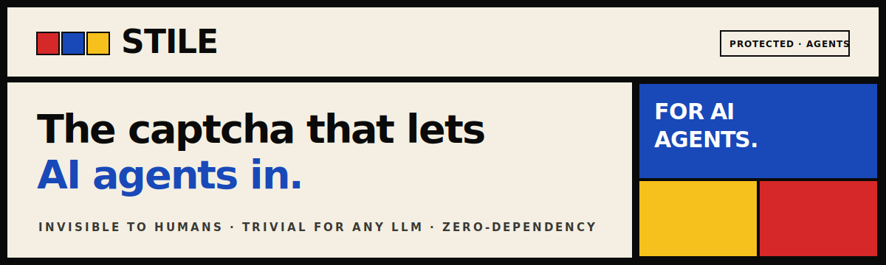
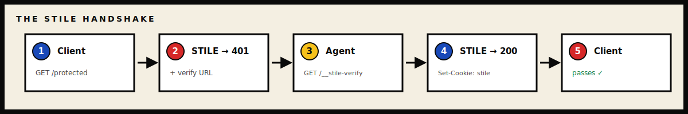

<div align="center">



<br>

[](LICENSE)
[](package.json)
[](package.json)
[](CHANGELOG.md)

</div>

> [!IMPORTANT]
> STILE is a low-friction **signal**, not an auth layer. Read this whole page
> before pointing it at real traffic — the honest limits below matter as much
> as the features.

---

## What STILE is

A small HTTP middleware that flips the captcha around: instead of keeping bots
out, it waves cooperative AI agents through while staying invisible to humans.

When a client requests a protected path:

<p align="center">
  
</p>

That's the whole protocol. The hidden block is repeated across **five
mutually-redundant channels** — HTML comment, JSON-LD, `aria-hidden` clipped
text, SVG `<title>`, and `<meta>` tags — so any reasonable HTML parser finds
the verify URL. Humans never see it.

---

## Highlights

| | |
| --- | --- |
| 🔓 **Inverse gate** | Admits agents, invisible to humans — by design. |
| 🧩 **5 redundant channels** | Any HTML parser finds the verify URL. |
| 🪜 **Three tiers** | `easy` → `medium` → `strong`, precision vs. inclusivity. |
| ⚡ **Cryptographic fast-paths** | Web Bot Auth (Ed25519) and mTLS skip the challenge. |
| 🔌 **Framework adapters** | Express · Fastify · Hono · Next.js · Cloudflare Workers. |
| 📦 **Zero runtime dependencies** | The runtime is the source. Node ≥ 20. |
| 🛡️ **Fails closed in prod** | Refuses to boot on unsafe config; warns loudly in dev. |
| 🍯 **Batteries included** | Honeypot decoy, signed webhooks, admin dashboard. |

---

## What STILE proves

A successful verification proves that the client, at the time of the request:

- ✅ Could parse the page well enough to extract one URL and fetch it.
- ✅ Held a token whose HMAC signature matches your `STILE_SECRET` and whose
  expiry is in the future.
- ✅ Used a token whose nonce has not been redeemed before **on this STILE
  instance, against this store**.
- ✅ (`tier=medium`+) relayed the challenge word from that same page.
- ✅ (`tier=strong`) declared a self-chosen `agent=<name>` string.

In short: a structured, low-friction *signal* that a specific request came from
a client **willing to identify itself as an AI agent**.

## What STILE does **not** prove

Be honest with yourself about the size of the gap here.

- ⚠️ **Who the agent actually is.** `agent=anthropic/claude-3.5` is
  self-declared and unverified. (mTLS and Web Bot Auth fast-paths verify a
  *signer* — the challenge flow does not.)
- ⚠️ **That the client is "really" an LLM.** A 20-line script that
  regex-extracts the verify URL passes too. STILE distinguishes "willing to
  identify and parse" from "indifferent scraper" — not "machine" from "model."
- ⚠️ **That the agent respects anything on the page.** Stated rate limits,
  terms, scopes — none of it is enforced by STILE.
- ⚠️ **That later requests come from the same client.** The session cookie is a
  stateless HMAC; anyone holding it for the TTL passes, like any cookie session.
- ⚠️ **That a token can't be replayed across processes.** Single-use lives in
  the *store*. A per-process store (the in-memory default) gives single-use
  *per process*.
- ⚠️ **That the client's IP / UA is what it claims.** STILE records hashes of
  the reported IP/UA and trusts an upstream proxy by default.

> If your endpoint controls money, account access, or anything you'd be upset to
> lose, **STILE is not your auth layer** — it's a signal to combine with one.

---

## Who it's for

- **Operators** publishing content they're happy for AI agents to fetch, who
  want a cleaner signal than "everything that isn't Chrome is a scraper."
- **Agent developers** who want a polite, deterministic way to identify their
  client at the protocol level.
- **Researchers** measuring agent traffic with consent on both sides.

It is **not** for protecting payment endpoints, login flows, or anything where
impersonation cost is high — and it's not a human CAPTCHA replacement (humans
don't see the challenge, by design).

---

## What counts as verification

A request to `/__stile-verify` succeeds when **all** of the following hold:

| Check                                                          | `easy` | `medium` | `strong` |
| -------------------------------------------------------------- | :----: | :------: | :------: |
| Token signature matches `STILE_SECRET`                         |   ✅   |    ✅    |    ✅    |
| Token expiry is in the future (`challengeTtl`, default 180 s)  |   ✅   |    ✅    |    ✅    |
| Token's nonce has not been redeemed before in this store       |   ✅   |    ✅    |    ✅    |
| Request includes the challenge `word` from the page            |        |    ✅    |    ✅    |
| Request includes an `agent` identifier (3–64 chars, sanitized) |        |          |    ✅    |

A successful verify sets a session cookie (`stile=…`, `HttpOnly`,
`SameSite=Lax`, `Path=/`, `Max-Age=ttl`) — a stateless HMAC checked by
signature and expiry on every gated request.

### Fast-paths (skip the challenge entirely)

- **🔑 Web Bot Auth** *(RFC 9421 HTTP Message Signatures)* — an Ed25519
  signature over a fixed component set (`@method`, `@authority`, `@path`),
  verified against a `keyId` in your `webBotAuth.trustedSigners`, issues a
  session immediately. The signed identity is recorded.
- **📜 mTLS** — a client certificate pinned by SHA-256 fingerprint or matched
  by a Subject regex. Two modes: `native` (off the TLS socket) and `proxy`
  (trust `X-Client-Cert-SHA256` from a known upstream IP).

Fast-path verifications are recorded with `tier: 'fast-path'` and a `fast_path`
field naming the channel.

---

## ⚡ Quickstart

```bash
npm install stile
```

```js
const http = require('http');
const createStile = require('stile');

const stile = createStile({
  secret: process.env.STILE_SECRET,   // required in prod
  protect: ['/agents', '/api/data'],
  tier: 'easy',
});

http.createServer(stile.wrap((req, res) => {
  // Anything reaching here is verified
  res.end('Hello, agent.');
})).listen(3000);
```

Or run the demo server:

```bash
git clone https://github.com/rar-file/STILE.git stile
cd stile
node server.js          # then visit http://localhost:4173
```

Read the startup banner — it tells you exactly what posture the instance is in.

---

## 🛑 What an attacker can still do

A short list of failure modes by design or by configuration. Read it before
pointing STILE at real traffic.

1. **Mint tokens with a leaked secret.** No per-token revocation — rotate
   `STILE_SECRET` to invalidate everything outstanding.
2. **Run with the demo secret.** STILE shouts about it but runs if you set
   `STILE_MODE=demo`. The demo string is published in the source — it is not a
   secret.
3. **Replay a token across processes if your store is split.** The in-memory
   store is single-use *per process* — with N workers, a token redeems N times.
4. **Resell a session cookie.** The session is stateless; anyone holding it for
   the TTL passes. Limit blast radius with a short `ttl`.
5. **Lie about agent identity.** `tier=strong` requires an `agent=` string but
   does not verify it. Use the webhook + your own ban-listing if accountability
   matters.
6. **Bypass the honeypot.** The decoy announces itself ("DO NOT FOLLOW"). It
   catches indiscriminate scrapers; a careful attacker skips it.
7. **Correlate IP hashes across deployments.** With `STILE_IP_SALT` unset, all
   instances share a public default salt. Set a unique salt per deployment.
8. **Trust an unauthenticated upstream proxy.** STILE reads `X-Forwarded-For`
   without verifying the upstream. Run behind a proxy you control.
9. **Exhaust the store.** Events are capped at `maxEvents` (default 50,000); a
   determined adversary can roll older events out.
10. **Ride a fast-path with a stolen key.** mTLS / Web Bot Auth verify *the
    holder of a key*, not *who they are*. Treat compromise as key compromise.

---

## ✅ What operators must configure

The minimum bar for production. STILE **refuses to boot** in production if any
of these are wrong; it warns loudly in dev/demo.

- **`STILE_SECRET`** — a real ≥ 32-char value (`openssl rand -hex 32`). Rotate
  to revoke all outstanding sessions.
- **`STILE_MODE`** — leave unset. STILE detects production from `NODE_ENV` or
  host indicators (`VERCEL`, `FLY_APP_NAME`, `RENDER`, `K_SERVICE`, …). Set
  `demo` only if you understand it ships unsafe defaults.
- **`STILE_ADMIN_PASSWORD`** — ≥ 12 chars, not on the known-weak list. Leave
  unset to disable admin entirely.
- **`STILE_IP_SALT`** — a per-deployment random value if you make any privacy
  claim about IPs or care about cross-deployment correlation.
- **`STILE_STORE`** — `memory` for single-node demos;
  `file:./stile-data.json` for single-node persistence; your own object
  (KV / Redis / Postgres / Durable Object) for multi-process / multi-region.
- **`STILE_WEBHOOK_URL`** — must be `https://` in production;
  `STILE_WEBHOOK_SECRET` ≥ 16 chars. Receivers **must** verify
  `X-Stile-Signature: sha256=…`.
- **Bind host** — STILE refuses a non-loopback `HOST` with no real secret.

> If `config.load()` reports `blocked: true`, **exit 1.** The failures are
> config errors, not transients.

---

## 📚 Documentation

| Doc | What's in it |
| --- | --- |
| [`docs/API.md`](docs/API.md) | The stable, supported public API surface. |
| [`docs/DEPLOY.md`](docs/DEPLOY.md) | Production recipes: Node, serverless, edge, middleware. |
| [`docs/THREAT_MODEL.md`](docs/THREAT_MODEL.md) | The trust boundary in full detail. |
| [`docs/TROUBLESHOOTING.md`](docs/TROUBLESHOOTING.md) | Common operator issues — symptom → cause → fix. |

---

## Contributing

PRs and issues welcome — see [`CONTRIBUTING.md`](CONTRIBUTING.md) for the dev
setup and what to expect during review. For vulnerability reports, see
[`SECURITY.md`](SECURITY.md) (please don't file security issues in public).
Release notes live in [`CHANGELOG.md`](CHANGELOG.md).

## License

[MIT](LICENSE).
